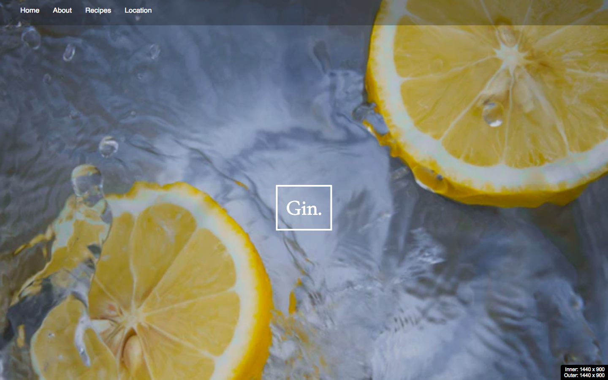
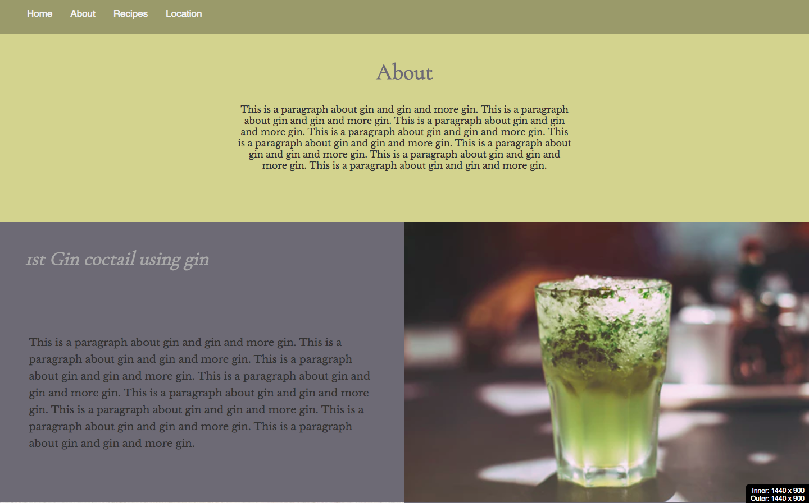
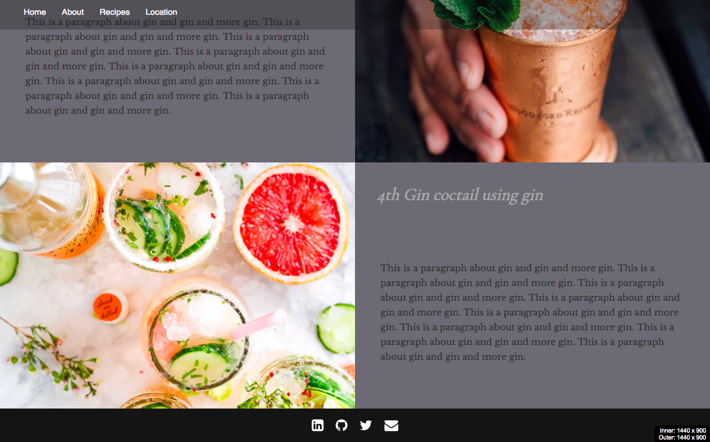

# Gin.

<p align="center" style="padding: 20px 0;">
  
</p>

Full app can be seen here at https://lit-garden-13159.herokuapp.com/

**[Gallery](#gallery)**  

I wanted to play around with an angular front-end for a one page site without using bootstrap and paying particular attention to making the site responsive.

In the end it turned out to worked pretty well in just HTMML SCSS JavaScript format, but I want to add a few bits that make use the angular soon like a scroll affect between links rather than the current.

#### Installation and deployment instructions

This app already has a `bower.json` file with `angular` as a dependency. To install run:

```sh
$ bower install && npm install
```
Deploying to Heroku:

I deployed the Rails API and front-end app separately to Heroku.  

I then added the front-end link to the backend Cors file (in config). and then added Herkou config varibales:

```sh
$ heroku config:add NODE_ENV=production
$ heroku config:add NPM_CONFIG_PRODUCTION=false
```

### Still to do:

* Scroll affect
* Content and recipies
* add hover affects - animation to make look more exciting

## Gallery
<br>
<p align="center">
  
</p>

<p align="center">
  
</p>
